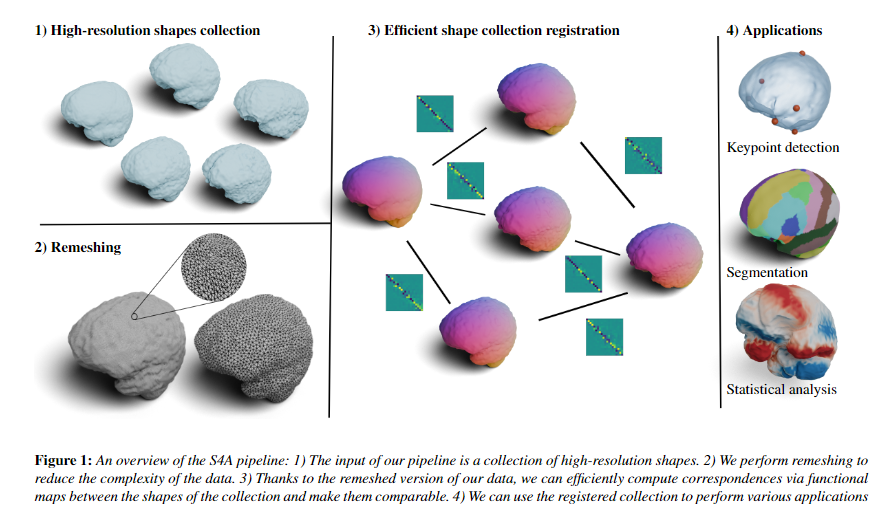

S4A: Scalable Spectral Statistical Shape Analysis
=======

Installation
------------

For ``pyRMT`` follow the instructions [here](https://github.com/filthynobleman/rematching/tree/python-binding).

How to use
----------
TO DO
